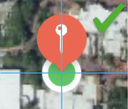
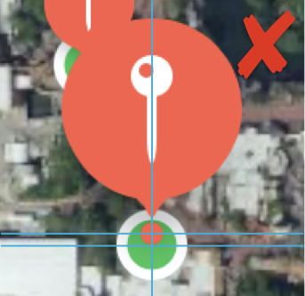
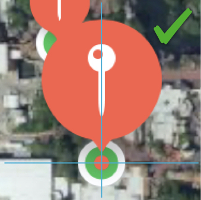

# MKMarkerAnnotationView Center Y-Offset But

## Bug Report ID

FB8153662 (MKMarkerAnnotationView center y-offset is incorrect when selected)

## Screen shots

**The marker view’s unselected state looks correct**

----

**The marker view’s selected center y-offset appears to be off by 3.5 points. The center of the marker view’s “dot” should be in the center of the “green annotation”** 

----

**Uncomment the “did select” code in the sample project to force adjust the center y-offset. This is what the user expects to see but does not see.**

----

## Selected MKMarkerAnnotationView Center Y-Offset Is Wrong

Steps to reproduce
- launch the sample app
  - two annotation views appear for each annotation
    - custom "green" dot annotation view
    - `MKMarkerAnnotationView`
  - tap on any marker annotation view to select it
  - actual result
    - user sees the marker annotation view's "small dot" hovering just above the center of the "green dot" annotation
  - expected result
    - user sees the marker annotation view's "small dot" hovering directly in the center of the "green dot" annotation
